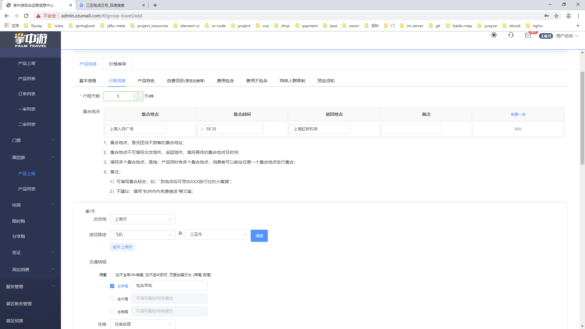
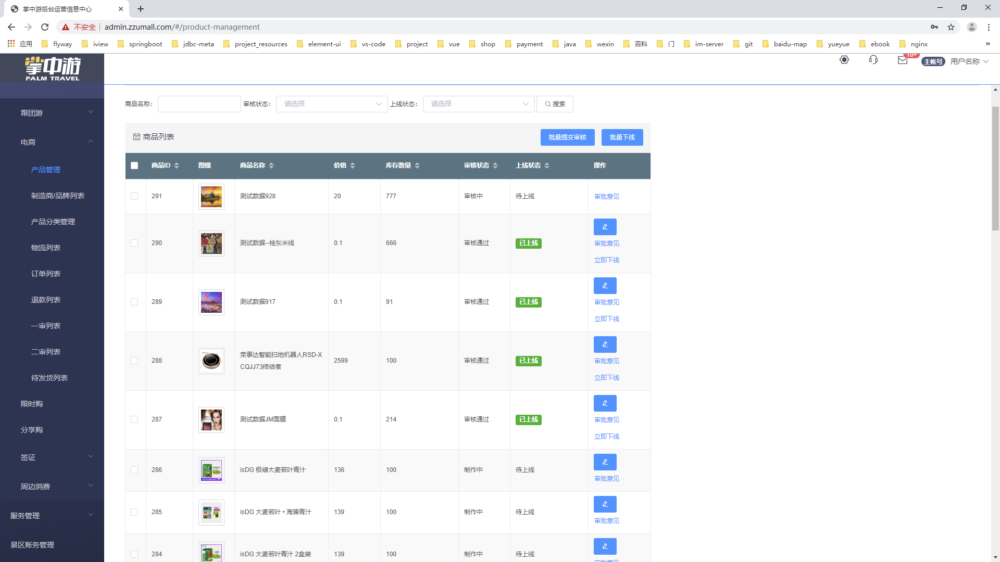

# Welcome to your visit

## 掌中游旅游项目--后台管理系统()

### 前端VUE和ELEMENT-UI 后端Spring boot, kotlin, mybatis, gradle, flyway, postgresql

- 跟团游业务--价格库存配置使用div自己封装的日期区间选取组件(农历和节假日计算,跨月选取日期配置价格和库存)

- 跟团游上架配置界面(目的地,游玩天数,行程路线配置,购买须知,关联酒店,交通,其他消费项目,供应商结算)

- 自由行业务-价格库存配置, 吃喝玩乐资源配置, 根据资源打包新的套餐,定价和结算价

- 门票业务 完成票种科配置, 关联景点, 门票上架,购买规则和阶梯退款规则

- 电商模块,供应商结算,物流模板可配置,限时购,分享购,关联景点附近周边消费

- 掌中游项目设计的库表(138张)

- 智能景区业务,根据地图坐标查询酒店,门店,景点介绍

## 早期作品
### 上海捷翌公司 app,微信端,商城,物流配送app

